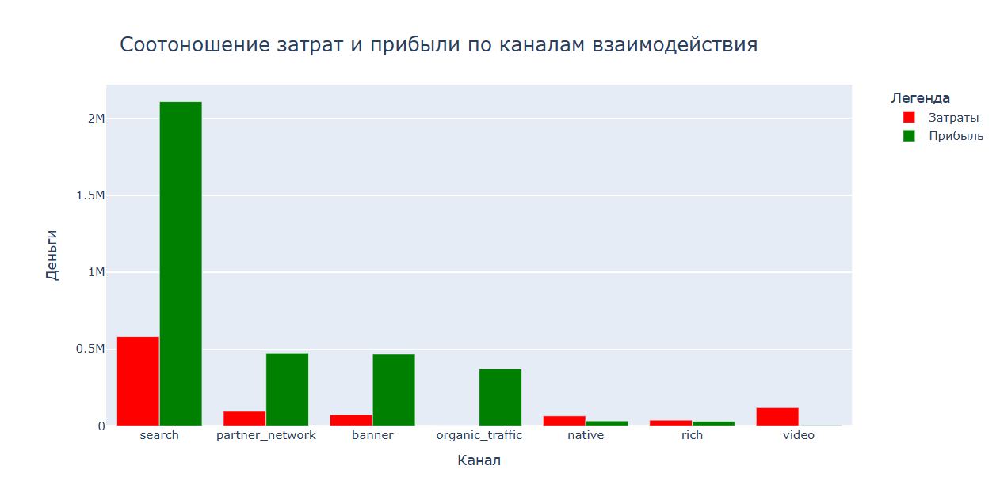

# online-cinema-marketing-analysis

## Overview

The main objectives of this project were to evaluate the quality of traffic and identify potential fraud. The analysis focused on studying the funnel stages where traffic manipulation occurred, and constructing clean funnels after excluding fraudulent users. In addition, the project aimed to detect unprofitable advertising channels, redistribute the marketing budget more effectively, and test the hypothesis that organic traffic does not differ significantly from paid traffic.

Note: Comments and outputs in the Jupyter notebooks are in Russian.

## Project structure

*Data Loading.ipynb* - notebook with loading all datasets and combining data into a resulting dataset.
*Data preparation and traffic quality analysis.ipynb* - сorrecting data errors, analyzing the number of users at different stages of the funnel and checking traffic quality.
*Сorrelation analysis.ipynb* - сorrelation analysis of features of a cleaned dataset (without fraudulent traffic).
*Visualization.ipynb* - notebook with diagram of distribution of operating systems of users for each advertising channel, diagrams of costs for each advertising channel and profit from them, visualization of the sales funnel across all advertising channels.
*Testing hypotheses.ipynb* - testing hypotheses and redistributing the budget across advertising channels.
*images/* — folder with visualizations used in the notebooks and README 

## Requirements 

- Python 3.9+  
- Jupyter Notebook  
- pandas, json, seaborn, plotly, scipy, statsmodels, sklearn

## Dataset

The data in this project was collected from various sources.
The datasets for seven different advertising channels (banner, video, native, partner_network, rich, search, organic_traffic) contain the following attributes:
*user_id* — unique user identifier;
*funnel_stage* — funnel stage (interest, consideration, intent, purchase);
*timestamp* — time of the user’s action;
*profit* — profit at the purchase stage; in all other cases marked as None;
*os* — operating system of the user’s device.

The dataset with advertising costs by channels contains:
*ad_channel* — advertising channel name;
*price* — advertising cost.

## Steps in the project

### Data loading 

The data on advertising channels was provided in CSV and Excel files.
The data on advertising costs was presented in a JSON file.
After loading and saving each as a DataFrame, the DataFrames with advertising channels were concatenated into a single DataFrame, which was then supplemented with the price attribute according to the corresponding channel.
The resulting DataFrame was sorted by timestamp and contains 4228781 rows and 7 columns with the following data types:
*ad_channel, funnel_stage, os* — object;
*user_id, timestamp* — int;
*price, profit* — float.

### Data preparation

The records in the funnel_stage column were converted to lowercase.
Missing values in the profit column were replaced with 0, since profit can only be obtained at the final stage of the funnel, while the DataFrame contains records for all stages.
Missing values in the price column accounted for 0.5% and were removed.

### Advertising traffic analysis

For all advertising sources, the early funnel stages (interest, consideration) are characterized by high traffic. However, only a minimal number of users reach the final stage. This may indicate either an incorrectly targeted audience or fraudulent traffic.
The most suspicious channels are video and native, where, despite a huge number of interested users, only a few dozen or even just a handful proceed to purchase. This may suggest click fraud and requires further investigation.

Analysis of the number of actions performed by a single user at a given point in time revealed that some user_ids perform more than one action simultaneously, which is not typical for a real user. This is illustrated in the histogram below.

This indicates that data from certain channels may have been falsified.
The proportion of such falsified data accounts for 76.84%.

The funnel stages that were most subject to falsification were interest and intent.

Then a data frame cleared of fraudulent traffic was used.

The least promising channel is video, as, despite a comparable number of users at the first stage of the funnel, the conversion rate is the lowest compared to the banner, organic_traffic, and partner_network channels.

The most profitable channel is search. Costs for native, rich, video channels exceed profits from them. Video is the most unprofitable channel and expenses are 33 times higher than its income, and only 0.01% of transferred clients reach the target action.

The majority of clients from the banner, organic_traffic, video channels use Android rather than iOS. At the same time, clients from the native, rich, search channels use iOS more and clients from  partner_network use both operating sistems in equally. Moreover, the search and partner_network channels are the most profitable of all.

The existence of a relationship between the channel and the operating system (although weak, it is still present) is also visible on the correlation heatmap. This demonstrates that some channels display ads predominantly to users of one operating system rather than another.

The Pearson coefficients for the features Android, profit and iOS, profit are too small, indicating that there is no correlation between these variables. This suggests that the type of operating system does not affect profit. Therefore, when choosing the advertising channel for budget increases, we can disregard search.

Among the three profitable paid channels, this leaves banner and partner_network, whose costs and profits are approximately equal. Moreover, these channels are essentially similar to rich and native, which are unprofitable. Therefore, I propose reallocating the advertising budgets as follows: rich → banner and native → partner_network.

After the calculations presented in the notebook testing_hypotheses.ipynb, the following ratio of costs and profits was obtained after disabling unprofitable channels and reallocating the budget.

### Testing hypothesis 

The statistical difference between the proportions of users coming from paid advertising channels and organic_traffic was assessed using a Z-test.

H0: The proportions of users from organic and other channels are the same at each stage of the funnel.
H1: The proportions of users from organic and other channels differ at each stage of the funnel.

Based on the test results, the null hypothesis cannot be accepted, as the p-values are below 0.05 at each funnel stage. The high magnitude of the test statistics, along with their negative sign, indicates that the proportion in the second group (other user interaction channels) is higher.

## Results

Fraudulent traffic accounted for 76.84% of data.
Identified video, native, and rich channels as unprofitable.
Suggested budget reallocation: rich → banner, native → partner_network.
Hypothesis testing confirmed that organic traffic differs from paid traffic.

